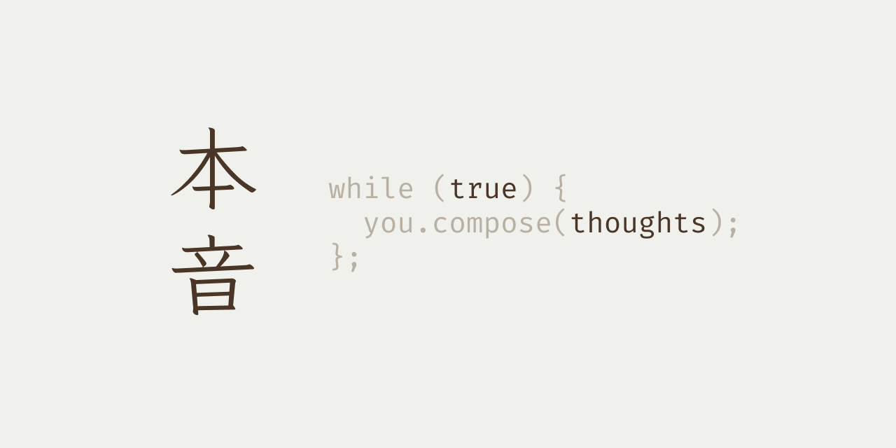

> *Japanese (noun)*: one's true feelings and thoughts.

# Honne, 本音
A special kind of diary to compose your true thoughts privately.

## Technologies

## License
Honne was distributed under the MIT License.
